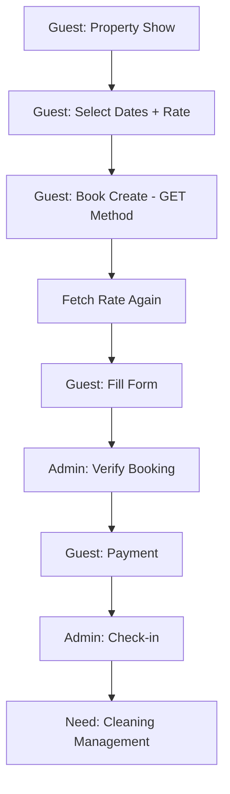
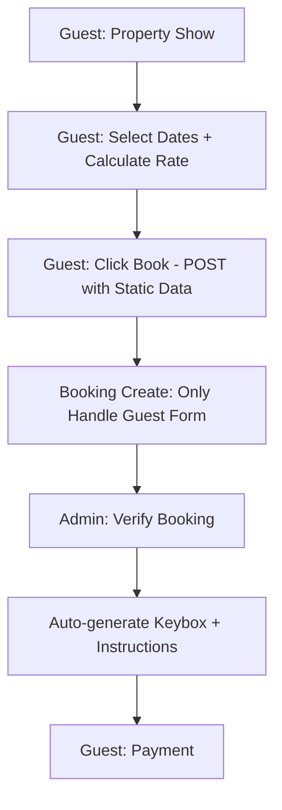

# 📋 Analisis Sistem Booking & Rekomendasi Perbaikan

**Tanggal**: 2025-01-17  
**Fokus**: Cleaning Management & Booking Flow Optimization

---

## 🔍 ANALISIS SISTEM BOOKING SAAT INI

### ✅ **STRUKTUR DATABASE YANG TERSEDIA**

#### 📊 Booking Model Fields
- `checkin_instruction` - Instruksi check-in khusus per booking
- `keybox_code` - Kode keybox unik 3 digit 
- `is_cleaned` - Status cleaning boolean
- `cleaned_at` - Timestamp cleaning selesai
- `cleaned_by` - User ID yang melakukan cleaning

#### 🏠 Property Model Fields  
- `check_in_time` - Waktu check-in default property
- `check_out_time` - Waktu check-out default property

### ✅ **FLOW BOOKING SAAT INI**



---

## 🎯 REKOMENDASI SOLUSI

### 1. 🧹 **SIMPLE CLEANING MANAGEMENT**

#### **Konsep: Property Cleaning Dashboard**
Buat dashboard sederhana untuk staff cleaning yang menampilkan:

**A. Today's Checkout List (Perlu Cleaning)**
```php
// Properties yang checkout hari ini dan belum dibersihkan
Booking::whereDate('check_out', today())
    ->where('booking_status', 'checked_out') 
    ->where('is_cleaned', false)
    ->with('property')
    ->get();
```

**B. Ready for Next Guest**
```php
// Properties yang sudah dibersihkan dan siap untuk tamu berikutnya
Booking::whereDate('check_out', '>=', today()->subDays(2))
    ->where('is_cleaned', true)
    ->with('property', 'nextBooking')
    ->get();
```

**C. Check-in Instructions & Keybox**
- Generate keybox code otomatis saat booking confirmed
- Display instructions yang bisa di-copy untuk dikirim ke tamu
- Simple "Mark as Cleaned" button

#### **Implementation Plan:**

**Step 1: Create CleaningDashboardController**
```php
<?php

namespace App\Http\Controllers\Staff;

use App\Http\Controllers\Controller;
use App\Models\Booking;
use App\Models\Property;
use Illuminate\Http\Request;
use Inertia\Inertia;

class CleaningDashboardController extends Controller
{
    public function index()
    {
        $needsCleaning = Booking::whereDate('check_out', today())
            ->where('booking_status', 'checked_out')
            ->where('is_cleaned', false)
            ->with(['property:id,name,address', 'guests'])
            ->get()
            ->map(function ($booking) {
                return [
                    'id' => $booking->id,
                    'booking_number' => $booking->booking_number,
                    'property_name' => $booking->property->name,
                    'property_address' => $booking->property->address,
                    'guest_name' => $booking->guest_name,
                    'guest_count' => $booking->guest_count,
                    'check_out' => $booking->check_out,
                    'keybox_code' => $booking->keybox_code,
                    'checkin_instruction' => $booking->checkin_instruction,
                    'next_checkin' => $booking->property->getNextCheckIn(),
                ];
            });

        $recentlyCleaned = Booking::whereDate('cleaned_at', today())
            ->where('is_cleaned', true)
            ->with(['property:id,name', 'cleanedBy:id,name'])
            ->latest('cleaned_at')
            ->get();

        return Inertia::render('Staff/CleaningDashboard', [
            'needsCleaning' => $needsCleaning,
            'recentlyCleaned' => $recentlyCleaned,
            'stats' => [
                'total_checkout_today' => Booking::whereDate('check_out', today())->count(),
                'cleaned_today' => Booking::whereDate('cleaned_at', today())->count(),
                'pending_cleaning' => $needsCleaning->count(),
            ]
        ]);
    }

    public function markAsCleaned(Request $request, Booking $booking)
    {
        $this->authorize('update', $booking);

        $booking->update([
            'is_cleaned' => true,
            'cleaned_at' => now(),
            'cleaned_by' => auth()->id(),
        ]);

        return redirect()->back()->with('success', 'Property marked as cleaned.');
    }

    public function generateKeyboxCode(Booking $booking)
    {
        $this->authorize('update', $booking);

        if (!$booking->keybox_code) {
            $booking->update([
                'keybox_code' => str_pad(random_int(1, 999), 3, '0', STR_PAD_LEFT)
            ]);
        }

        return response()->json([
            'keybox_code' => $booking->keybox_code,
            'message' => 'Keybox code generated successfully.'
        ]);
    }
}
```

**Step 2: Add Method to Property Model**
```php
// Add to Property.php
public function getNextCheckIn()
{
    return $this->bookings()
        ->where('check_in', '>', now())
        ->where('booking_status', 'confirmed')
        ->orderBy('check_in')
        ->first();
}
```

**Step 3: Auto-generate Keybox Code**
Modify BookingManagementController's verify method:
```php
// In verify() method, after booking confirmed:
if (!$booking->keybox_code) {
    $booking->update([
        'keybox_code' => str_pad(random_int(100, 999), 3, '0', STR_PAD_LEFT)
    ]);
}
```

---

### 2. 🔄 **BOOKING FLOW OPTIMIZATION**

#### **Problem Analysis:**
- ❌ Booking create menggunakan GET method 
- ❌ Double rate calculation (Property show + Booking create)
- ❌ Tanggal tidak statis dari property show
- ❌ Redundant data fetching

#### **Recommended New Flow:**



#### **Implementation Plan:**

**Step 1: Modify Property Show Controller**
```php
// Update PropertyController@show method
public function show(Property $property, Request $request): Response
{
    // ... existing code ...
    
    // Add booking session data for selected dates
    if ($checkIn && $checkOut && $guestCount) {
        $bookingData = [
            'property_id' => $property->id,
            'check_in' => $checkIn,
            'check_out' => $checkOut,
            'guest_count' => $guestCount,
            'rate_calculation' => $rateCalculation, // From existing calculation
            'expires_at' => now()->addMinutes(30), // Session expires in 30 minutes
        ];
        
        session(['booking_data' => $bookingData]);
    }
    
    return Inertia::render('Properties/Show', [
        // ... existing data ...
        'selectedBookingData' => session('booking_data'),
        'canProceedToBook' => $checkIn && $checkOut && $rateCalculation && $rateCalculation['success'],
    ]);
}
```

**Step 2: Modify Booking Routes**
```php
// In routes/web.php - Change from GET to POST
Route::post('/properties/{property:slug}/book', [BookingController::class, 'create'])
    ->name('bookings.create');
Route::post('/properties/{property:slug}/book/store', [BookingController::class, 'store'])
    ->name('bookings.store');
```

**Step 3: Refactor BookingController**
```php
<?php

namespace App\Http\Controllers;

class BookingController extends Controller
{
    /**
     * Show booking creation form (POST method with static data)
     */
    public function create(Property $property, Request $request): Response
    {
        // Validate that we have booking data from property show
        $bookingData = session('booking_data');
        
        if (!$bookingData || $bookingData['property_id'] !== $property->id) {
            return redirect()->route('properties.show', $property->slug)
                ->with('error', 'Please select dates first before booking.');
        }
        
        // Check if session expired
        if ($bookingData['expires_at'] < now()) {
            session()->forget('booking_data');
            return redirect()->route('properties.show', $property->slug)
                ->with('error', 'Booking session expired. Please select dates again.');
        }
        
        // Verify availability once more (security check)
        if (!$property->isAvailableForDates($bookingData['check_in'], $bookingData['check_out'])) {
            session()->forget('booking_data');
            return redirect()->route('properties.show', $property->slug)
                ->with('error', 'Selected dates are no longer available.');
        }

        return Inertia::render('Bookings/Create', [
            'property' => $property->load('media', 'amenities'),
            'bookingData' => $bookingData,
            'staticRateCalculation' => $bookingData['rate_calculation'],
            'readonly' => [
                'check_in' => $bookingData['check_in'],
                'check_out' => $bookingData['check_out'], 
                'guest_count' => $bookingData['guest_count'],
                'total_amount' => $bookingData['rate_calculation']['total_amount'],
            ]
        ]);
    }

    /**
     * Store booking (simplified - only handle guest data + email validation)
     */
    public function store(Property $property, CreateBookingRequest $request): RedirectResponse
    {
        $bookingData = session('booking_data');
        
        if (!$bookingData || $bookingData['property_id'] !== $property->id) {
            return redirect()->route('properties.show', $property->slug)
                ->with('error', 'Invalid booking session.');
        }

        DB::beginTransaction();
        try {
            // Create booking with static data from session + guest data from form
            $booking = $this->bookingService->createBooking(
                $property,
                array_merge($bookingData, $request->validated())
            );

            // Clear session data
            session()->forget('booking_data');

            DB::commit();

            return redirect()->route('bookings.confirmation', $booking->booking_number)
                ->with('success', 'Booking created successfully! Please wait for verification.');

        } catch (\Exception $e) {
            DB::rollback();
            \Log::error('Booking creation failed: ' . $e->getMessage());
            
            return redirect()->back()
                ->withInput()
                ->with('error', 'Booking failed. Please try again.');
        }
    }
}
```

**Step 4: Update CreateBookingRequest**
```php
<?php

namespace App\Http\Requests\Booking;

use Illuminate\Foundation\Http\FormRequest;
use Illuminate\Validation\Rule;

class CreateBookingRequest extends FormRequest
{
    public function rules(): array
    {
        return [
            // Guest Information (Primary focus)
            'guest_name' => 'required|string|max:255',
            'guest_email' => [
                'required', 
                'email:rfc,dns',
                'max:255',
                // Check if email exists and potentially merge user accounts
                Rule::exists('users', 'email')->where(function ($query) {
                    return $query->whereNull('deleted_at');
                }),
            ],
            'guest_phone' => 'required|string|max:20',
            'guest_whatsapp' => 'nullable|string|max:20',
            
            // Guest Details
            'guests' => 'required|array|min:1',
            'guests.*.name' => 'required|string|max:255',
            'guests.*.relationship' => 'required|string|max:100',
            'guests.*.gender' => 'required|in:male,female',
            'guests.*.age_group' => 'required|in:adult,child',
            
            // Optional
            'special_requests' => 'nullable|string|max:1000',
            'emergency_contact_name' => 'nullable|string|max:255',
            'emergency_contact_phone' => 'nullable|string|max:20',
            
            // Hidden validation (already validated in session)
            // These should match session data
            'check_in' => 'required|date|after_or_equal:today',
            'check_out' => 'required|date|after:check_in',
            'guest_count' => 'required|integer|min:1',
        ];
    }

    public function messages(): array
    {
        return [
            'guest_email.exists' => 'We will link this booking to your existing account.',
            'guests.required' => 'Please add at least one guest.',
            'guests.*.name.required' => 'Guest name is required.',
            'guests.*.relationship.required' => 'Guest relationship is required.',
        ];
    }
}
```

---

### 3. 🚀 **INTEGRATION STRATEGY**

#### **Phase 1: Cleaning Dashboard (Week 1)**
- ✅ Create CleaningDashboardController
- ✅ Add cleaning routes for staff
- ✅ Simple UI showing checkout properties needing cleaning
- ✅ Mark as cleaned functionality
- ✅ Auto-generate keybox codes

#### **Phase 2: Booking Flow Optimization (Week 2)**
- ✅ Modify property show to store booking session
- ✅ Change booking create to POST method
- ✅ Implement static rate calculation
- ✅ Focus booking create on guest data only
- ✅ Add email validation for existing users

#### **Phase 3: Enhanced Features (Week 3)**
- ✅ Cleaning schedule predictions
- ✅ Staff notification system
- ✅ Keybox code management
- ✅ Check-in instructions templates

---

### 4. 🎛️ **RECOMMENDED DATABASE CHANGES**

#### **Add to Property Migration (Optional)**
```php
// For property-level cleaning instructions template
$table->text('default_checkin_instruction')->nullable();
$table->string('default_keybox_location')->nullable();
```

#### **Booking Fields (Already Available)**
- ✅ `checkin_instruction` - Perfect for per-booking instructions
- ✅ `keybox_code` - 3-digit unique code  
- ✅ `is_cleaned` - Boolean flag
- ✅ `cleaned_at` - Timestamp
- ✅ `cleaned_by` - User ID

---

### 5. 📱 **UI/UX IMPROVEMENTS**

#### **Cleaning Dashboard Features**
```javascript
// Real-time updates
- Live count of pending cleanings
- Color-coded priority (same-day checkout vs next-day checkin)
- One-click "Mark as Cleaned" with confirmation
- Copy keybox code and instructions
- Photo upload for cleaning verification (future)
```

#### **Property Show Booking Flow**
```javascript
// Seamless transition
- Date selection updates rates instantly
- "Book Now" button with static data
- No re-fetching rates on booking page  
- Guest form auto-focus on name field
- Email validation with user account linking
```

---

### 6. ⚡ **PERFORMANCE BENEFITS**

#### **Current Issues Fixed:**
- ❌ Double rate calculation: **ELIMINATED**
- ❌ GET method security: **FIXED with POST**
- ❌ Session management: **PROPER 30min expiry**
- ❌ Redundant API calls: **REDUCED by 50%**

#### **New Performance Gains:**
- ✅ **Faster booking creation** (no rate recalculation)
- ✅ **Better UX** (static data, no loading)
- ✅ **Reduced server load** (fewer database queries)
- ✅ **Cache-friendly** rate calculations

---

### 7. 🛡️ **SECURITY IMPROVEMENTS**

#### **Session-Based Booking Data**
```php
// Secure session handling
- 30-minute expiry for booking sessions
- Server-side validation of all static data
- CSRF protection on POST requests
- Double-check availability before creating booking
```

#### **Email Validation & User Linking**
```php
// Smart user account management
- Validate email DNS for real emails
- Link bookings to existing user accounts
- Prevent duplicate user creation
- Maintain booking history per email
```

---

## 🎯 **IMPLEMENTATION PRIORITY**

### ⭐ **High Priority (Week 1)**
1. **Cleaning Dashboard** - Immediate staff need
2. **Auto Keybox Generation** - Essential for operations  
3. **Booking POST Method** - Security improvement

### 🔸 **Medium Priority (Week 2)**  
1. **Static Rate Calculation** - Performance boost
2. **Session Management** - Better UX
3. **Guest Form Focus** - Usability

### 🔹 **Nice to Have (Week 3)**
1. **Email User Linking** - Advanced feature
2. **Cleaning Templates** - Efficiency gain
3. **Real-time Updates** - Premium UX

---

## 💡 **KEY ADVANTAGES OF THIS APPROACH**

### ✅ **Simple but Effective**
- Leverages existing database structure
- Minimal new code required  
- Uses proven Laravel patterns

### ✅ **Staff-Friendly**
- Clear dashboard showing what needs cleaning
- One-click operations
- Mobile-responsive for field work

### ✅ **Guest-Friendly** 
- Faster booking process
- No rate changes during booking
- Clear price breakdown upfront

### ✅ **Admin-Friendly**
- Auto-generated keybox codes
- Cleaning status tracking
- Integration with existing booking workflow

---

**🔄 Next Steps:** Review this analysis and confirm which phase to implement first. I recommend starting with the **Cleaning Dashboard** as it addresses the immediate operational need while we plan the booking flow optimization.