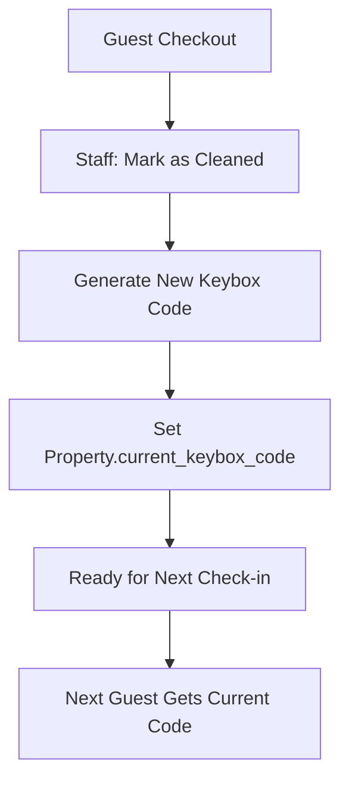
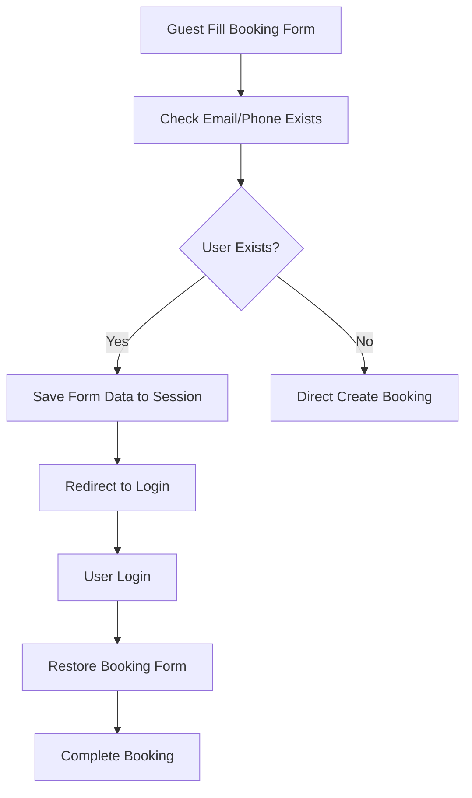

# 📋 Sistem Booking - Rekomendasi Revisi

**Tanggal**: 2025-01-17  
**Status**: REVISED - Based on Feedback  
**Focus**: Keybox Management, Login Flow, WhatsApp Integration

---

## 🔧 KONSEP YANG DIPERBAIKI

### 1. 🔑 **KEYBOX MANAGEMENT (REVISED)**

#### **Konsep Baru:**
- ❌ ~~Auto-generate saat booking confirmed~~
- ✅ **Generate saat checkout selesai dan property cleaned**
- ✅ **Keybox code di-set di Property level** (bukan booking level)
- ✅ **Code berubah setiap selesai cleaning** untuk next guest

#### **Flow Keybox:**


### 2. 📝 **CHECKIN INSTRUCTION (REVISED)**

#### **Konsep Baru:**
- ✅ **Static instruction di Property model**
- ✅ **Format JSON** untuk structured data
- ✅ **Template system** dengan placeholders
- ✅ **Property edit form** untuk admin input

### 3. 🔐 **LOGIN FLOW DENGAN BOOKING PERSISTENCE**

#### **Flow:**


### 4. 💬 **WHATSAPP INTEGRATION**

#### **Features:**
- ✅ **Chat button** di booking detail admin
- ✅ **Template pesan** dengan booking data
- ✅ **Auto password** untuk new user
- ✅ **Direct WhatsApp link** dengan pre-filled message

---

## 🛠️ IMPLEMENTASI DETAIL

### 1. 🗄️ **DATABASE MIGRATION CHANGES**

#### **Add to Properties Table:**
```php
<?php
// Migration: add_keybox_and_instructions_to_properties_table.php

use Illuminate\Database\Migrations\Migration;
use Illuminate\Database\Schema\Blueprint;
use Illuminate\Support\Facades\Schema;

return new class extends Migration
{
    public function up()
    {
        Schema::table('properties', function (Blueprint $table) {
            // Keybox management
            $table->string('current_keybox_code', 3)->nullable()->after('check_out_time');
            $table->timestamp('keybox_updated_at')->nullable()->after('current_keybox_code');
            $table->unsignedBigInteger('keybox_updated_by')->nullable()->after('keybox_updated_at');
            
            // Check-in instructions as JSON
            $table->json('checkin_instructions')->nullable()->after('keybox_updated_by');
            
            // Foreign key
            $table->foreign('keybox_updated_by')->references('id')->on('users');
        });
    }

    public function down()
    {
        Schema::table('properties', function (Blueprint $table) {
            $table->dropForeign(['keybox_updated_by']);
            $table->dropColumn([
                'current_keybox_code',
                'keybox_updated_at', 
                'keybox_updated_by',
                'checkin_instructions'
            ]);
        });
    }
};
```

#### **Remove from Bookings Table:**
```php
// Since keybox is now property-level, remove from bookings if exists
Schema::table('bookings', function (Blueprint $table) {
    $table->dropColumn(['keybox_code', 'checkin_instruction']);
});
```

### 2. 🏠 **UPDATE PROPERTY MODEL**

```php
<?php
// app/Models/Property.php

class Property extends Model
{
    protected $fillable = [
        // ... existing fields ...
        'current_keybox_code',
        'keybox_updated_at',
        'keybox_updated_by',
        'checkin_instructions',
    ];

    protected $casts = [
        // ... existing casts ...
        'checkin_instructions' => 'array',
        'keybox_updated_at' => 'datetime',
    ];

    /**
     * Generate new keybox code and update property
     */
    public function generateNewKeyboxCode($updatedBy = null): string
    {
        $newCode = str_pad(random_int(100, 999), 3, '0', STR_PAD_LEFT);
        
        $this->update([
            'current_keybox_code' => $newCode,
            'keybox_updated_at' => now(),
            'keybox_updated_by' => $updatedBy ?? auth()->id(),
        ]);

        return $newCode;
    }

    /**
     * Get formatted check-in instructions with current keybox code
     */
    public function getFormattedCheckinInstructions(): array
    {
        $instructions = $this->checkin_instructions ?? [];
        
        // Replace placeholders with actual data
        return array_map(function($instruction) {
            if (is_string($instruction)) {
                return str_replace(
                    ['{{keybox_code}}', '{{property_name}}', '{{address}}'],
                    [$this->current_keybox_code, $this->name, $this->address],
                    $instruction
                );
            }
            return $instruction;
        }, $instructions);
    }

    /**
     * Default check-in instructions template
     */
    public static function getDefaultCheckinInstructionsTemplate(): array
    {
        return [
            'welcome' => 'Selamat datang di {{property_name}}!',
            'keybox_location' => 'Keybox terletak di depan pintu masuk.',
            'keybox_code' => 'Kode keybox: {{keybox_code}}',
            'checkin_time' => 'Check-in time: 14:00 - 22:00',
            'emergency_contact' => 'Hubungi kami jika ada kendala: 0812-3456-7890',
            'additional_info' => [
                'WiFi password tersedia di dalam rumah',
                'Harap menjaga kebersihan selama menginap',
                'Check-out maksimal pukul 12:00'
            ]
        ];
    }

    /**
     * Relationship to user who updated keybox
     */
    public function keyboxUpdatedBy()
    {
        return $this->belongsTo(User::class, 'keybox_updated_by');
    }
}
```

### 3. 🧹 **REVISED CLEANING DASHBOARD**

```php
<?php
// app/Http/Controllers/Staff/CleaningDashboardController.php

namespace App\Http\Controllers\Staff;

use App\Http\Controllers\Controller;
use App\Models\Booking;
use App\Models\Property;
use Illuminate\Http\Request;
use Inertia\Inertia;
use Illuminate\Support\Facades\DB;

class CleaningDashboardController extends Controller
{
    public function index()
    {
        // Properties that checked out today and need cleaning
        $needsCleaning = Booking::whereDate('check_out', today())
            ->where('booking_status', 'checked_out')
            ->where('is_cleaned', false)
            ->with(['property:id,name,address,current_keybox_code', 'guests'])
            ->get()
            ->map(function ($booking) {
                return [
                    'id' => $booking->id,
                    'booking_number' => $booking->booking_number,
                    'property_name' => $booking->property->name,
                    'property_address' => $booking->property->address,
                    'guest_name' => $booking->guest_name,
                    'guest_count' => $booking->guest_count,
                    'check_out' => $booking->check_out,
                    'current_keybox_code' => $booking->property->current_keybox_code,
                    'next_checkin' => $booking->property->getNextCheckIn(),
                    'priority' => $this->calculateCleaningPriority($booking),
                ];
            });

        // Recently cleaned properties
        $recentlyCleaned = Booking::whereDate('cleaned_at', today())
            ->where('is_cleaned', true)
            ->with(['property:id,name,current_keybox_code,keybox_updated_at', 'cleanedBy:id,name'])
            ->latest('cleaned_at')
            ->get();

        return Inertia::render('Staff/CleaningDashboard', [
            'needsCleaning' => $needsCleaning,
            'recentlyCleaned' => $recentlyCleaned,
            'stats' => [
                'total_checkout_today' => Booking::whereDate('check_out', today())->count(),
                'cleaned_today' => Booking::whereDate('cleaned_at', today())->count(),
                'pending_cleaning' => $needsCleaning->count(),
                'high_priority' => $needsCleaning->where('priority', 'high')->count(),
            ]
        ]);
    }

    /**
     * Mark as cleaned and generate new keybox code
     */
    public function markAsCleaned(Request $request, Booking $booking)
    {
        $this->authorize('update', $booking);

        DB::beginTransaction();
        try {
            // Mark booking as cleaned
            $booking->update([
                'is_cleaned' => true,
                'cleaned_at' => now(),
                'cleaned_by' => auth()->id(),
            ]);

            // Generate new keybox code for property
            $newKeyboxCode = $booking->property->generateNewKeyboxCode(auth()->id());

            DB::commit();

            return redirect()->back()->with('success', 
                "Property cleaned successfully! New keybox code: {$newKeyboxCode}"
            );

        } catch (\Exception $e) {
            DB::rollback();
            \Log::error('Mark as cleaned failed: ' . $e->getMessage());
            
            return redirect()->back()->with('error', 'Failed to mark as cleaned.');
        }
    }

    /**
     * Calculate cleaning priority based on next check-in
     */
    private function calculateCleaningPriority(Booking $booking): string
    {
        $nextBooking = $booking->property->getNextCheckIn();
        
        if (!$nextBooking) {
            return 'low';
        }

        $hoursUntilNextCheckin = now()->diffInHours($nextBooking->check_in);
        
        if ($hoursUntilNextCheckin <= 6) {
            return 'high';
        } elseif ($hoursUntilNextCheckin <= 24) {
            return 'medium';
        }
        
        return 'low';
    }

    /**
     * Get current keybox code for property (for staff reference)
     */
    public function getKeyboxCode(Property $property)
    {
        $this->authorize('view', $property);

        return response()->json([
            'keybox_code' => $property->current_keybox_code,
            'last_updated' => $property->keybox_updated_at,
            'updated_by' => $property->keyboxUpdatedBy?->name,
        ]);
    }
}
```

### 4. 📝 **PROPERTY MANAGEMENT UPDATE**

```php
<?php
// Update app/Http/Controllers/Admin/PropertyManagementController.php

public function edit(Property $property): Response
{
    return Inertia::render('Admin/Properties/Edit', [
        'property' => $property->load('amenities', 'media'),
        'amenities' => Amenity::orderBy('name')->get(),
        'defaultCheckinTemplate' => Property::getDefaultCheckinInstructionsTemplate(),
        'currentKeyboxInfo' => [
            'code' => $property->current_keybox_code,
            'last_updated' => $property->keybox_updated_at,
            'updated_by' => $property->keyboxUpdatedBy?->name,
        ]
    ]);
}

public function update(Request $request, Property $property): RedirectResponse
{
    $validated = $request->validate([
        // ... existing validation rules ...
        'checkin_instructions' => 'nullable|array',
        'checkin_instructions.welcome' => 'nullable|string|max:500',
        'checkin_instructions.keybox_location' => 'nullable|string|max:500',
        'checkin_instructions.keybox_code' => 'nullable|string|max:500',
        'checkin_instructions.checkin_time' => 'nullable|string|max:200',
        'checkin_instructions.emergency_contact' => 'nullable|string|max:200',
        'checkin_instructions.additional_info' => 'nullable|array',
        'checkin_instructions.additional_info.*' => 'string|max:300',
    ]);

    try {
        $property->update($validated);

        return redirect()->route('admin.properties.show', $property)
            ->with('success', 'Property updated successfully.');
    } catch (\Exception $e) {
        return redirect()->back()
            ->withInput()
            ->with('error', 'Failed to update property.');
    }
}
```

### 5. 🔐 **LOGIN FLOW WITH BOOKING PERSISTENCE**

```php
<?php
// app/Http/Controllers/BookingController.php

class BookingController extends Controller
{
    /**
     * Handle booking creation with user checking
     */
    public function store(Property $property, CreateBookingRequest $request): RedirectResponse
    {
        $validated = $request->validated();
        
        // Check if user exists with email or phone
        $existingUser = User::where('email', $validated['guest_email'])
            ->orWhere('phone', $validated['guest_phone'])
            ->first();

        if ($existingUser && !auth()->check()) {
            // Save booking data to session
            session([
                'pending_booking_data' => [
                    'property_id' => $property->id,
                    'form_data' => $validated,
                    'booking_session' => session('booking_data'),
                    'created_at' => now(),
                ]
            ]);

            return redirect()->route('login')
                ->with('info', 'We found an existing account with your email/phone. Please login to continue booking.')
                ->with('intended_url', route('bookings.resume'));
        }

        // Proceed with normal booking creation
        return $this->createBookingNormally($property, $validated);
    }

    /**
     * Resume booking after login
     */
    public function resumeBooking(): RedirectResponse
    {
        if (!auth()->check()) {
            return redirect()->route('login');
        }

        $pendingData = session('pending_booking_data');
        
        if (!$pendingData || $pendingData['created_at']->lt(now()->subHours(2))) {
            session()->forget('pending_booking_data');
            return redirect()->route('properties.index')
                ->with('error', 'Booking session expired. Please start again.');
        }

        $property = Property::find($pendingData['property_id']);
        
        if (!$property) {
            return redirect()->route('properties.index')
                ->with('error', 'Property not found.');
        }

        // Restore session data
        session(['booking_data' => $pendingData['booking_session']]);

        try {
            // Create booking with saved data
            $booking = $this->createBookingNormally($property, $pendingData['form_data']);
            
            // Clear pending data
            session()->forget('pending_booking_data');
            
            return redirect()->route('bookings.confirmation', $booking->booking_number)
                ->with('success', 'Welcome back! Your booking has been created successfully.');

        } catch (\Exception $e) {
            return redirect()->route('properties.show', $property->slug)
                ->with('error', 'Failed to create booking. Please try again.');
        }
    }

    private function createBookingNormally(Property $property, array $data)
    {
        // Your existing booking creation logic
        $bookingData = session('booking_data');
        
        if (!$bookingData || $bookingData['property_id'] !== $property->id) {
            throw new \Exception('Invalid booking session.');
        }

        DB::beginTransaction();
        try {
            $booking = $this->bookingService->createBooking(
                $property,
                array_merge($bookingData, $data)
            );

            session()->forget('booking_data');
            DB::commit();

            return $booking;
        } catch (\Exception $e) {
            DB::rollback();
            throw $e;
        }
    }
}
```

### 6. 🔐 **AUTH MIDDLEWARE WITH INTENDED URL**

```php
<?php
// app/Http/Middleware/RedirectIfAuthenticated.php (update)

class RedirectIfAuthenticated
{
    public function handle(Request $request, Closure $next, string ...$guards): Response
    {
        $guards = empty($guards) ? [null] : $guards;

        foreach ($guards as $guard) {
            if (Auth::guard($guard)->check()) {
                // Check if there's an intended URL
                $intendedUrl = session('intended_url');
                
                if ($intendedUrl) {
                    session()->forget('intended_url');
                    return redirect($intendedUrl);
                }

                return redirect(RouteServiceProvider::HOME);
            }
        }

        return $next($request);
    }
}

// app/Http/Controllers/Auth/LoginController.php (update)

class LoginController extends Controller
{
    protected function authenticated(Request $request, $user)
    {
        // Check for intended URL after login
        $intendedUrl = session('intended_url');
        
        if ($intendedUrl) {
            session()->forget('intended_url');
            return redirect($intendedUrl);
        }

        return redirect()->intended(route('dashboard'));
    }
}
```

### 7. 💬 **WHATSAPP INTEGRATION IN BOOKING DETAIL**

```php
<?php
// app/Http/Controllers/Admin/BookingManagementController.php

public function show(Booking $booking): Response
{
    $this->authorize('view', $booking);

    $booking->load([
        'property',
        'guests',
        'services',
        'payments.paymentMethod',
        'workflow.processor'
    ]);

    // Generate WhatsApp message template
    $whatsappData = $this->generateWhatsAppMessage($booking);

    return Inertia::render('Admin/Bookings/Show', [
        'booking' => $booking,
        'whatsappData' => $whatsappData,
    ]);
}

/**
 * Generate WhatsApp message template
 */
private function generateWhatsAppMessage(Booking $booking): array
{
    $property = $booking->property;
    $checkinInstructions = $property->getFormattedCheckinInstructions();
    
    // Check if user is new (created recently)
    $isNewUser = $booking->created_by && 
                 User::find($booking->created_by)?->created_at->gte(now()->subDays(1));

    $message = "*Konfirmasi Booking #{$booking->booking_number}*\n\n";
    $message .= "Halo {$booking->guest_name},\n\n";
    $message .= "Booking Anda telah dikonfirmasi:\n";
    $message .= "📍 *Property*: {$property->name}\n";
    $message .= "📅 *Check-in*: {$booking->check_in}\n";
    $message .= "📅 *Check-out*: {$booking->check_out}\n";
    $message .= "👥 *Jumlah Tamu*: {$booking->guest_count} orang\n";
    $message .= "💰 *Total*: Rp " . number_format($booking->total_amount, 0, ',', '.') . "\n\n";

    if ($property->current_keybox_code) {
        $message .= "*Informasi Check-in:*\n";
        
        if (isset($checkinInstructions['welcome'])) {
            $message .= "• {$checkinInstructions['welcome']}\n";
        }
        if (isset($checkinInstructions['keybox_location'])) {
            $message .= "• {$checkinInstructions['keybox_location']}\n";
        }
        if (isset($checkinInstructions['keybox_code'])) {
            $message .= "• {$checkinInstructions['keybox_code']}\n";
        }
        if (isset($checkinInstructions['checkin_time'])) {
            $message .= "• {$checkinInstructions['checkin_time']}\n";
        }
        
        if (isset($checkinInstructions['additional_info']) && is_array($checkinInstructions['additional_info'])) {
            $message .= "\n*Informasi Tambahan:*\n";
            foreach ($checkinInstructions['additional_info'] as $info) {
                $message .= "• {$info}\n";
            }
        }
        
        if (isset($checkinInstructions['emergency_contact'])) {
            $message .= "\n📞 {$checkinInstructions['emergency_contact']}\n";
        }
    }

    // Add login info for new users
    if ($isNewUser) {
        $user = User::find($booking->created_by);
        $tempPassword = 'temp' . rand(1000, 9999); // This should be generated during user creation
        
        $message .= "\n*Akun Login Anda:*\n";
        $message .= "• Email: {$user->email}\n";
        $message .= "• Password: {$tempPassword}\n";
        $message .= "• Login di: " . route('login') . "\n";
        $message .= "_Silakan ganti password setelah login_\n";
    }

    $message .= "\nTerima kasih telah memilih properti kami! 🏠";

    return [
        'phone' => $this->formatPhoneNumber($booking->guest_phone),
        'message' => $message,
        'whatsapp_url' => "https://wa.me/{$this->formatPhoneNumber($booking->guest_phone)}?text=" . urlencode($message),
        'can_send' => !empty($booking->guest_phone),
    ];
}

/**
 * Format phone number for WhatsApp
 */
private function formatPhoneNumber(string $phone): string
{
    // Remove all non-numeric characters
    $phone = preg_replace('/[^0-9]/', '', $phone);
    
    // Convert Indonesian format to international
    if (substr($phone, 0, 1) === '0') {
        $phone = '62' . substr($phone, 1);
    } elseif (substr($phone, 0, 2) !== '62') {
        $phone = '62' . $phone;
    }
    
    return $phone;
}

/**
 * Send WhatsApp message (redirect to WhatsApp Web)
 */
public function sendWhatsApp(Booking $booking): RedirectResponse
{
    $this->authorize('view', $booking);
    
    $whatsappData = $this->generateWhatsAppMessage($booking);
    
    if (!$whatsappData['can_send']) {
        return redirect()->back()->with('error', 'Guest phone number not available.');
    }

    return redirect($whatsappData['whatsapp_url']);
}
```

### 8. 🛣️ **UPDATED ROUTES**

```php
<?php
// routes/web.php - Add new routes

// Booking resume after login
Route::middleware(['auth'])->group(function () {
    Route::get('/booking/resume', [BookingController::class, 'resumeBooking'])
        ->name('bookings.resume');
});

// Staff cleaning dashboard
Route::middleware(['auth', 'role:super_admin,cleaning_staff,front_desk'])->group(function () {
    Route::get('/staff/cleaning', [CleaningDashboardController::class, 'index'])
        ->name('staff.cleaning.index');
    Route::patch('/staff/cleaning/{booking}/mark-cleaned', [CleaningDashboardController::class, 'markAsCleaned'])
        ->name('staff.cleaning.mark-cleaned');
    Route::get('/staff/cleaning/property/{property}/keybox', [CleaningDashboardController::class, 'getKeyboxCode'])
        ->name('staff.cleaning.keybox');
});

// Admin WhatsApp integration
Route::middleware(['auth', 'role:super_admin,property_manager,front_desk'])->group(function () {
    Route::get('/admin/bookings/{booking}/whatsapp', [BookingManagementController::class, 'sendWhatsApp'])
        ->name('admin.bookings.whatsapp');
});
```

### 9. 📱 **PROPERTY EDIT FORM (JSON INPUT)**

```javascript
// resources/js/Pages/Admin/Properties/Edit.vue - Add this component

<template>
    <div class="space-y-6">
        <!-- Existing form fields -->
        
        <!-- Check-in Instructions Section -->
        <div class="bg-white p-6 rounded-lg shadow">
            <h3 class="text-lg font-semibold mb-4">Check-in Instructions</h3>
            
            <div class="space-y-4">
                <div>
                    <label class="block text-sm font-medium text-gray-700">Welcome Message</label>
                    <input
                        v-model="form.checkin_instructions.welcome"
                        type="text"
                        class="mt-1 block w-full rounded-md border-gray-300"
                        placeholder="Selamat datang di {{property_name}}!"
                    />
                </div>

                <div>
                    <label class="block text-sm font-medium text-gray-700">Keybox Location</label>
                    <input
                        v-model="form.checkin_instructions.keybox_location"
                        type="text"
                        class="mt-1 block w-full rounded-md border-gray-300"
                        placeholder="Keybox terletak di depan pintu masuk"
                    />
                </div>

                <div>
                    <label class="block text-sm font-medium text-gray-700">Keybox Code Message</label>
                    <input
                        v-model="form.checkin_instructions.keybox_code"
                        type="text"
                        class="mt-1 block w-full rounded-md border-gray-300"
                        placeholder="Kode keybox: {{keybox_code}}"
                    />
                </div>

                <div>
                    <label class="block text-sm font-medium text-gray-700">Check-in Time</label>
                    <input
                        v-model="form.checkin_instructions.checkin_time"
                        type="text"
                        class="mt-1 block w-full rounded-md border-gray-300"
                        placeholder="Check-in time: 14:00 - 22:00"
                    />
                </div>

                <div>
                    <label class="block text-sm font-medium text-gray-700">Emergency Contact</label>
                    <input
                        v-model="form.checkin_instructions.emergency_contact"
                        type="text"
                        class="mt-1 block w-full rounded-md border-gray-300"
                        placeholder="Hubungi kami: 0812-3456-7890"
                    />
                </div>

                <!-- Additional Info Array -->
                <div>
                    <label class="block text-sm font-medium text-gray-700 mb-2">Additional Information</label>
                    
                    <div v-for="(info, index) in form.checkin_instructions.additional_info" :key="index" class="flex gap-2 mb-2">
                        <input
                            v-model="form.checkin_instructions.additional_info[index]"
                            type="text"
                            class="flex-1 rounded-md border-gray-300"
                            placeholder="Additional information..."
                        />
                        <button
                            @click="removeAdditionalInfo(index)"
                            type="button"
                            class="px-3 py-2 bg-red-500 text-white rounded-md hover:bg-red-600"
                        >
                            Remove
                        </button>
                    </div>
                    
                    <button
                        @click="addAdditionalInfo"
                        type="button"
                        class="mt-2 px-4 py-2 bg-blue-500 text-white rounded-md hover:bg-blue-600"
                    >
                        Add Information
                    </button>
                </div>

                <!-- Current Keybox Info -->
                <div v-if="currentKeyboxInfo.code" class="bg-gray-50 p-4 rounded-md">
                    <h4 class="font-medium text-gray-700">Current Keybox Info</h4>
                    <p class="text-sm text-gray-600">Code: <span class="font-mono">{{ currentKeyboxInfo.code }}</span></p>
                    <p class="text-sm text-gray-600">Last updated: {{ formatDate(currentKeyboxInfo.last_updated) }}</p>
                    <p class="text-sm text-gray-600">Updated by: {{ currentKeyboxInfo.updated_by }}</p>
                </div>

                <!-- Preview -->
                <div class="bg-blue-50 p-4 rounded-md">
                    <h4 class="font-medium text-blue-800 mb-2">Preview</h4>
                    <div class="text-sm text-blue-700 whitespace-pre-line">{{ previewInstructions }}</div>
                </div>
            </div>
        </div>
    </div>
</template>

<script setup>
import { computed } from 'vue'

const props = defineProps({
    property: Object,
    defaultCheckinTemplate: Object,
    currentKeyboxInfo: Object,
})

// Initialize form with existing data or defaults
const form = useForm({
    // ... existing form fields ...
    checkin_instructions: props.property.checkin_instructions || props.defaultCheckinTemplate,
})

const addAdditionalInfo = () => {
    if (!form.checkin_instructions.additional_info) {
        form.checkin_instructions.additional_info = []
    }
    form.checkin_instructions.additional_info.push('')
}

const removeAdditionalInfo = (index) => {
    form.checkin_instructions.additional_info.splice(index, 1)
}

const previewInstructions = computed(() => {
    const instructions = form.checkin_instructions
    let preview = ''
    
    if (instructions.welcome) preview += instructions.welcome + '\n'
    if (instructions.keybox_location) preview += instructions.keybox_location + '\n'
    if (instructions.keybox_code) preview += instructions.keybox_code.replace('{{keybox_code}}', props.currentKeyboxInfo.code || '123') + '\n'
    if (instructions.checkin_time) preview += instructions.checkin_time + '\n'
    
    if (instructions.additional_info && instructions.additional_info.length > 0) {
        preview += '\nAdditional Information:\n'
        instructions.additional_info.forEach(info => {
            if (info) preview += '• ' + info + '\n'
        })
    }
    
    if (instructions.emergency_contact) preview += '\n' + instructions.emergency_contact
    
    return preview
})
</script>
```

---

## 🎯 **IMPLEMENTATION SUMMARY**

### ✅ **Key Changes Made:**

1. **🔑 Keybox Management:**
   - Moved to Property level (not booking level)
   - Generated when cleaning completed
   - Tracked with timestamp and user

2. **📝 Check-in Instructions:**
   - JSON format in Property model
   - Template system with placeholders
   - Rich form interface for admin

3. **🔐 Login Flow:**
   - Session persistence for booking data
   - User existence checking
   - Automatic resume after login

4. **💬 WhatsApp Integration:**
   - Template messages with booking data
   - Auto-password for new users
   - Direct WhatsApp links from admin

5. **🛣️ Auth Middleware:**
   - Intended URL preservation
   - Seamless redirect after login

### 🚀 **Implementation Priority:**

1. **Week 1**: Database migration + Property model updates
2. **Week 2**: Cleaning dashboard + Keybox management  
3. **Week 3**: Login flow + WhatsApp integration
4. **Week 4**: Frontend forms + Testing

Apakah implementasi ini sudah sesuai dengan yang Anda inginkan?